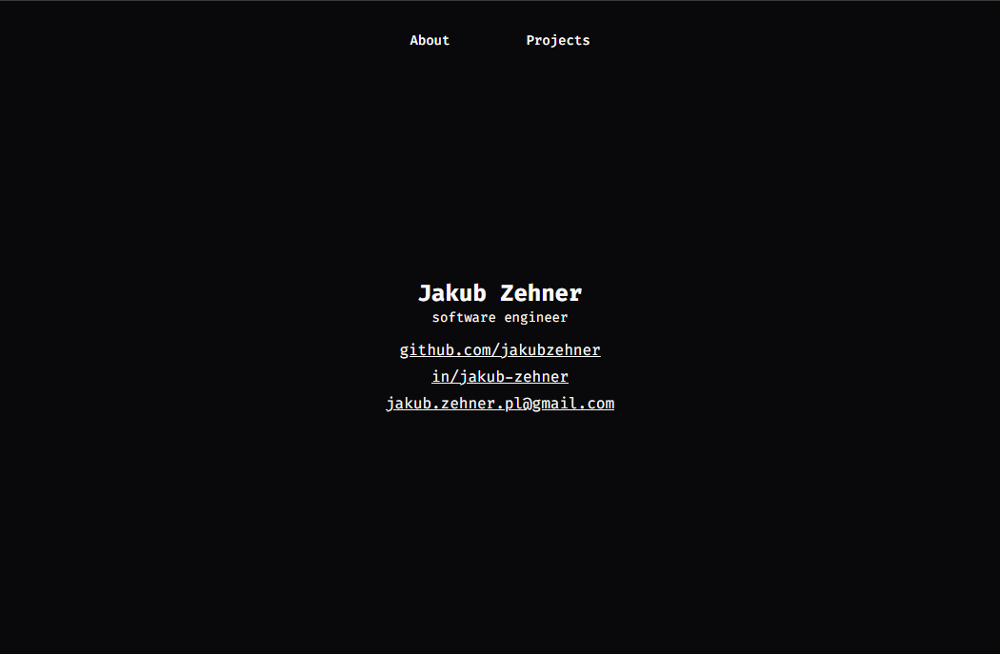

# [jzehner.dev](https://jzehner.dev) – a minimalistic personal website 🏠

<div align="center">


</div>



## Production 🌐

The website is available online at [jzehner.dev](https://jzehner.dev), deployed through [Cloudflare](https://www.cloudflare.com/developer-platform/products/workers/).

## Development 🏗

Run the development server:

```bash
npm run dev
```

You can build the project and preview an optimized version using:

```bash
npm run build
npm run preview
```
